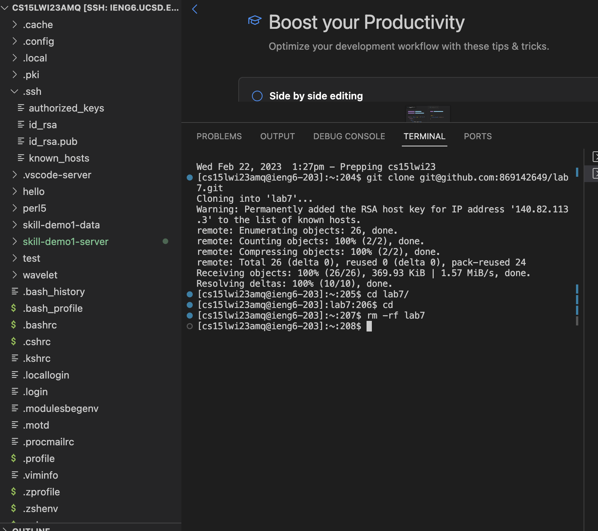
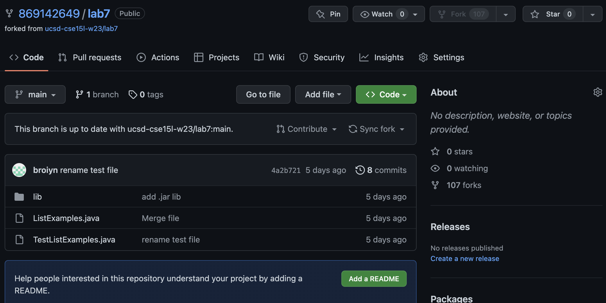
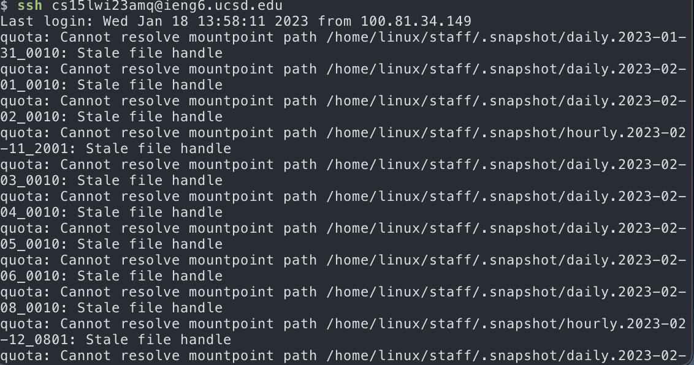
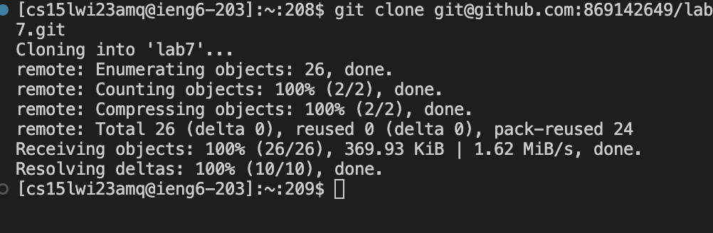
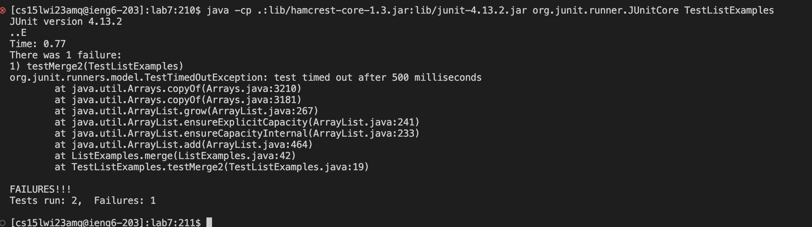
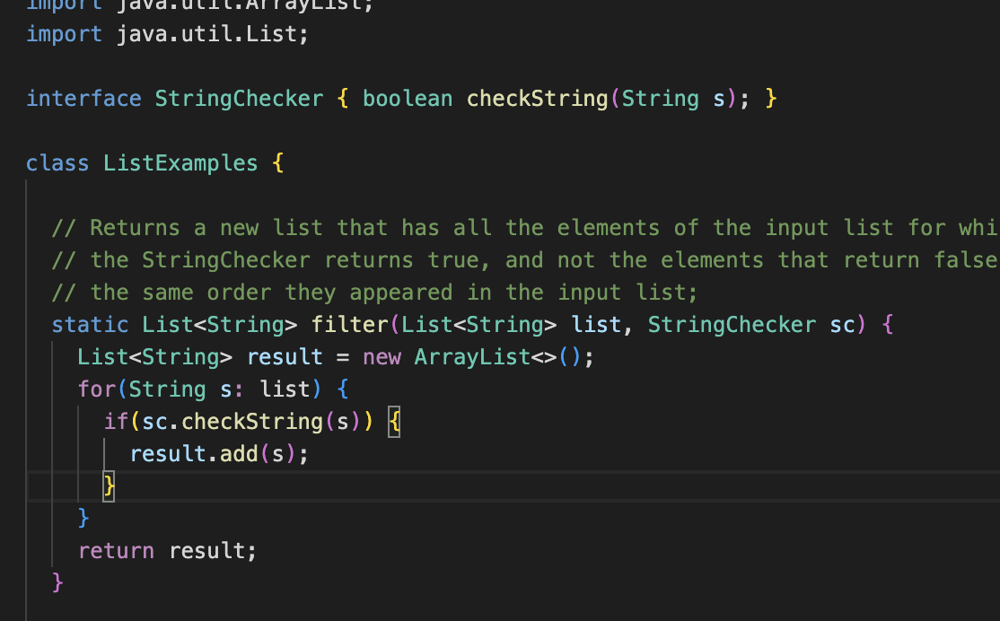
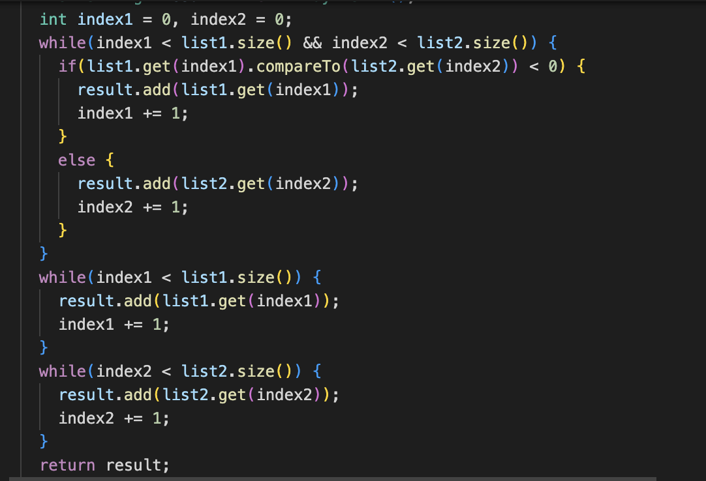
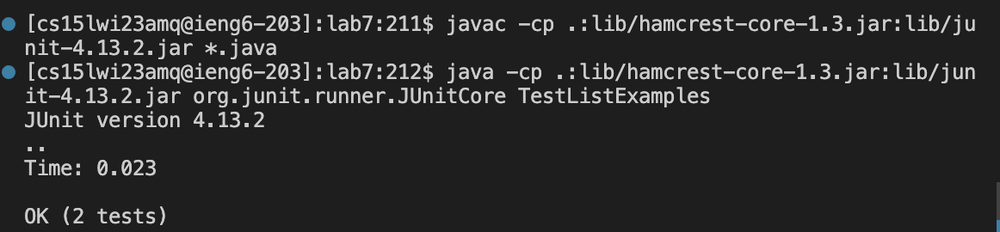
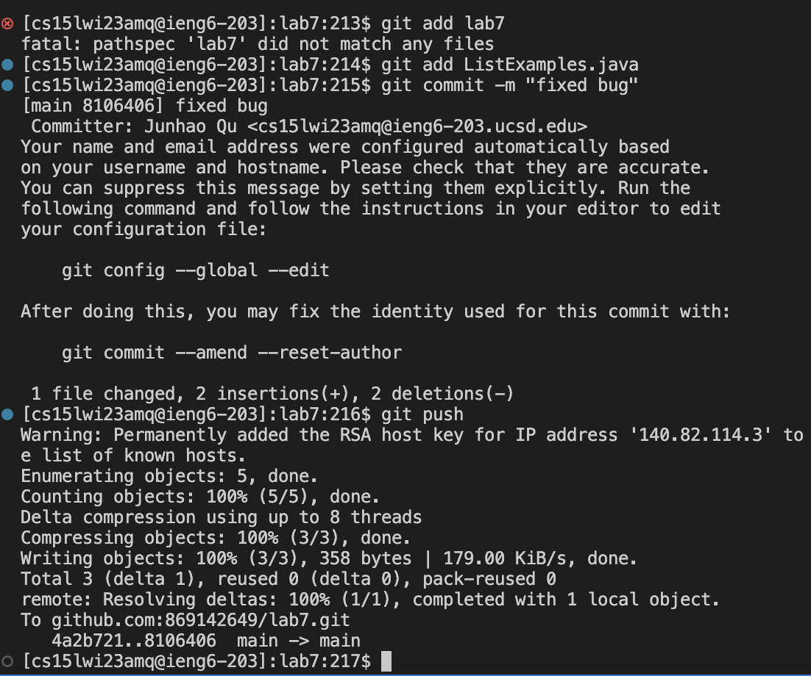

# Lab Report4


## 1. Setup Delete any existing forks of the repository you have on your account
   

In the first step, We use following command to remove the lab 7 inorder to git clone lab7 again.
We could use tab to auto file after type lab.

```
    $ rm -rf lab<tab>7
```


## 2. Setup Fork the repository
  

In the second step, we just fork on the Github, so we can create our own.


## 4. Log into ieng6
 

Since we already set up the SSH keys, we could use SSH login without typing passwords
We could use tab to auto file after type cs.

```
    $ ssh cs<tab>15lwi23amq@ieng6.ucsd.edu 
```

## 5. Clone your fork of the repository from your Github account
 

Since we already set up the SSH keys, we could use git clone with ssh.

```
    $ git clone ssh
```

## 6. Run the tests, demonstrating that they fail
 

We compile and run Junit test, and get the failed information.
We could use tab to auto file after type javac - cp and java -cp.


```
    $ javac -cp<tab> .:lib/hamcrest-core-1.3.jar:lib/junit-4.13.2.jar *.java
    $ java -cp<tab> .:lib/hamcrest-core-1.3.jar:lib/junit-4.13.2.jar org.junit.     runner.JUnitCore TestListExamples
```

## 7. Edit the code file to fix the failing test
 
 
 We see that there are two bug in our ListExamples.java

 ```
    //change add(0,s) to get correct add
    add(s);
    //change index1 += 1 to add index correctly to index2
    index2 += 1;
```

## 8. Run the tests, demonstrating that they now succeed
 

We compile and run Junit test again, and get the correct information.
We could use tab to auto file after type javac - cp and java -cp.

```
    $ javac -cp<tab> .:lib/hamcrest-core-1.3.jar:lib/junit-4.13.2.jar *.java
    $ java -cp<tab> .:lib/hamcrest-core-1.3.jar:lib/junit-4.13.2.jar org.junit.     runner.JUnitCore TestListExamples
```

## 9. Commit and push the resulting change to your Github account
 

In this stage, we just use git add, git commit and git push.
We could use tab to auto fill

```
    $ git add lab<tab>7
    $ gti co<tab>mmit -m ""
    $ git pu<tab>sh
``` 


